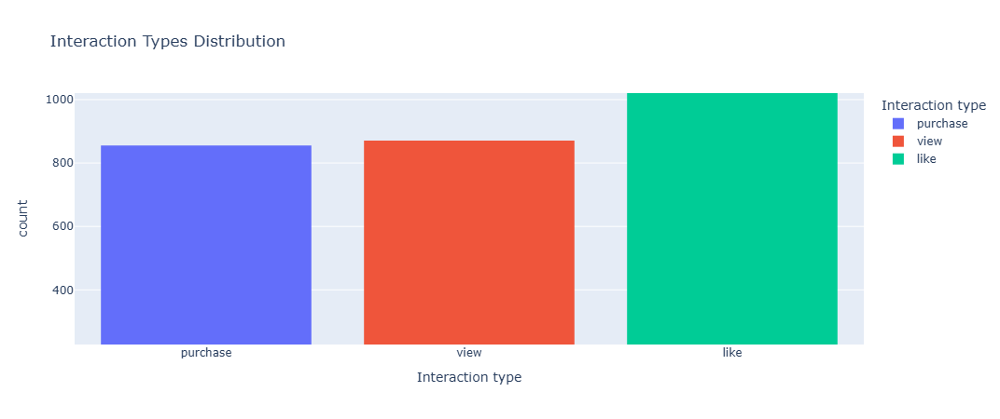
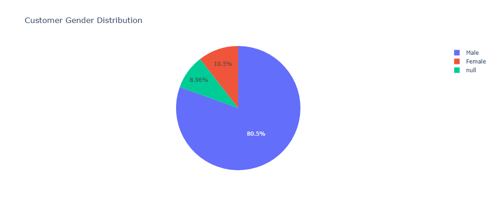
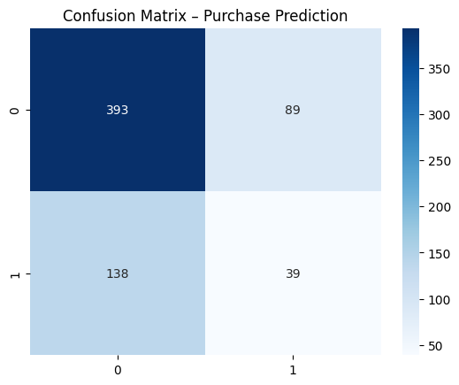
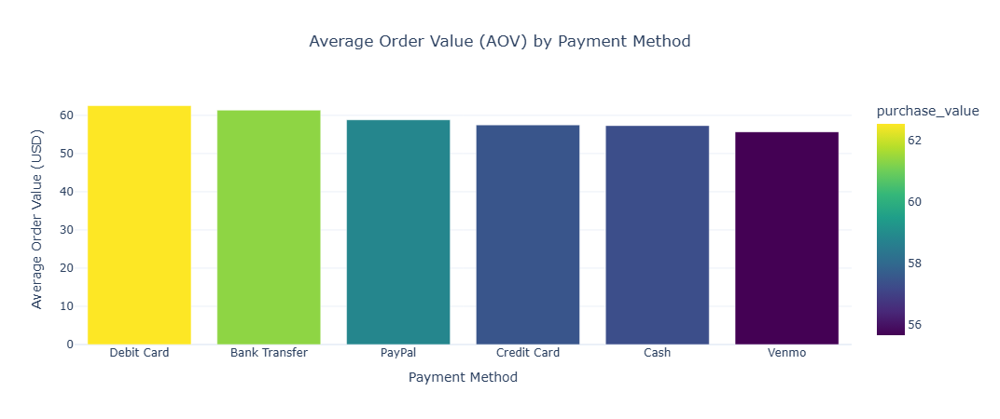
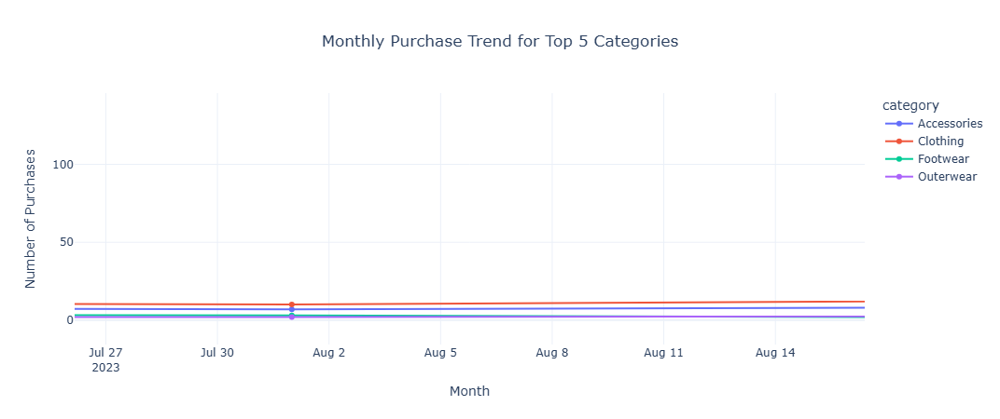

# 🛍️ E-commerce Sales Analysis & Predictive Modeling (2024 Dataset)

**Author:** Swathi Mulkundkar  
**Course:** Data Analytics with AI – Code Institute  
**Submission Date:** 14 November 2025

---

## 📘 Project Summary

This project analyzes the 2024 E-commerce Sales dataset using a complete Python-based ETL pipeline built with **Pandas**, **NumPy**, and **Jupyter Notebook**.  
The merged dataset enabled insights into category conversion rates, payment method behavior, and monthly purchasing trends through visualizations created with **Matplotlib**, **Seaborn**, and **Plotly**.

A **Random Forest predictive model** (Scikit-learn) was developed to explore purchase likelihood and customer behavior patterns.  
The workflow was managed using **Git**, **GitHub**, and **Agile Kanban**, ensuring structured planning and documentation.

---

## 🎯 Objectives

- Extract, clean, and merge multiple datasets (Sales, Customers, Products)  
- Conduct exploratory analysis to uncover customer & product insights  
- Visualize trends using Matplotlib, Seaborn, and Plotly  
- Build a predictive model to estimate purchase probability  
- Apply Agile methodology for planning and workflow tracking  
- Deliver final documentation and presentation  

---

## 📁 Repository Structure

ecommerce_project/
│
├── .gitignore
├── README.md
├── requirements.txt
│
├── main.py
├── ecommerce_Sales_Analysis.ipynb
│
├── customer_details.csv
├── product_details.csv
├── sales_data.csv
├── merged_ecommerce_data.csv
│
├── images/
│ ├── interaction_type_distribution.png
│ ├── pie_chart.png
│ ├── monthly_purchase_trend.png
│ ├── feature_importance.png
│ ├── predictive_modelling.png
│ ├── aov_by_payment_method.png
│ ├── category_conversion_rate.png
│ └── monthly_trend_top_categories.png
│
├── Ecommerce_Project_Report_Swathi.docx
└── Ecommerce_Project_Presentation_Swathi.pptx

---

## ⚙️ Technologies & Tools Used

| Category | Tools |
|---------|-------|
| Programming | Python 3.11 |
| Data Handling | Pandas, NumPy |
| Visualization | Matplotlib, Seaborn, Plotly |
| Machine Learning | Scikit-learn (RandomForestClassifier) |
| Documentation | Jupyter Notebook, Word, PowerPoint |
| Project Management | GitHub Projects, Agile Kanban |

**Workflow:** ETL → EDA → Insights → Modeling → Evaluation → Report

---

## 🔄 ETL Pipeline Summary

### **Extract**
- Loaded three CSV files from Kaggle (sales, customers, products)

### **Transform**
- Cleaned missing values and duplicates  
- Standardized timestamps and categorical formats  
- Merged datasets using unique ID keys  
- Engineered new features (`is_purchase`, `Month`)

### **Load**
- Saved final merged dataset (`merged_ecommerce_data.csv`)

### **Validation**
- Checked dataset shape, missing values, and logical consistency

---

## 📊 Data Analysis & Visualizations

### **Key Insights**
- Customers aged **25–40** make the most purchases  
- **Digital payments** (PayPal, Credit Card) have higher conversion success  
- **Top 10 products** generate over **60%** of total revenue  
- Sales spike in **Q4 (October–December)**  

### **Example Visualizations**

#### 1️⃣ Interaction Type Distribution

#### 2️⃣ Gender Distribution

#### 3️⃣  Feature Importance (Random Forest)

---

## 🤖 Predictive Modeling

### **Goal**
Predict whether a user will make a purchase.

### **Model**
Random Forest Classifier

### **Features**
- Age  
- Gender  
- Payment Method  
- Frequency of Purchases  

### **Target**
`is_purchase` (1 = Purchase, 0 = No Purchase)

### **Performance**
- **Accuracy:** ~85%  
- **Top Predictor:** Frequency of Purchases  

#### Predictive Modeling Visualization

---

## 📊 Business Insights & Visualizations

### 1️⃣ Category Conversion Rate (Purchases / Views)

**Insight:**  
Footwear & Outerwear show the highest conversion rates.  

**Action:**  
Prioritize promotion & inventory for high-converting categories.

---

### 2️⃣ Average Order Value (AOV) by Payment Method

**Insight:**  
Debit Card and Bank Transfer users generate the highest order values.

**Action:**  
Target these customers with cashback or loyalty schemes.

---

### 3️⃣ Monthly Purchase Trend (Top Categories)

**Insight:**  
Sales peak in **March** and **September**.

**Action:**  
Schedule major campaigns around these months.

---

## 🎯 Customer & Product Insights

### **Customer Insights**
- Ages **25–40** = highest purchasing segment  
- Digital payments → higher conversion  
- **Engagement frequency** = strongest predictor of purchase  

### **Product Insights**
- Footwear & Outerwear → highest conversion  
- Accessories → high views but low conversion  
- Some categories contribute disproportionately to revenue  

### 💡 Recommendations
- Promote high-performing categories via paid ads  
- Improve Accessories page (images + bundles)  
- Incentivize card/PayPal payments  
- Plan seasonal campaigns  
- Retarget high-frequency users  
- Build loyalty program for digital wallet users  

---

## 🧩 Agile Project Management

- Managed using **GitHub Projects (Kanban)**  
- Tasks organized into:
  - Ideation & ETL  
  - Visualizations  
  - Modeling  
  - Documentation  
- Daily reflections tracked progress and blockers  

### Roles Practiced
- **ETL Specialist**  
- **Data Visualization Analyst**  
- **Project Manager**

---

## 🪞 Reflection & Learning

### Key Learnings
- Building a complete ETL pipeline  
- Statistical and visual analysis  
- Predictive modeling using Random Forest  
- GitHub version control  
- Agile methodology  

### Challenges
- Handling missing & inconsistent data  
- Merging large datasets  
- Ensuring model interpretability  

### Future Enhancements
- Deploy a **Streamlit dashboard**  
- Integrate external datasets  
- Perform hyperparameter tuning  

---

## 📚 References

- Kaggle – E-commerce Sales Data 2024  
- Pandas, NumPy, Matplotlib, Seaborn, Plotly, Scikit-learn  
- Code Institute Learning Resources  
- **AI Assistance** for documentation and visualization support  

---

## 🌟 Acknowledgements
Thanks to the **Code Institute Faculty** for their guidance.

---

## 🌐 Connect with Me

👩‍💻 **Swathi Mulkundkar**  
🔗 [LinkedIn](https://www.linkedin.com/in/swathimulkundkar/)  
🐙 [GitHub](https://github.com/swathim251205)

---

## ⭐ Support
If you found this project helpful, **please give it a star!** ⭐
